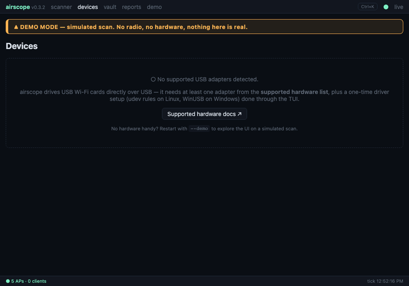
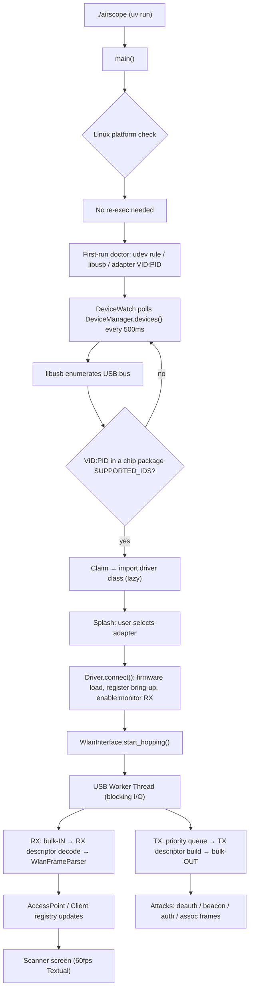
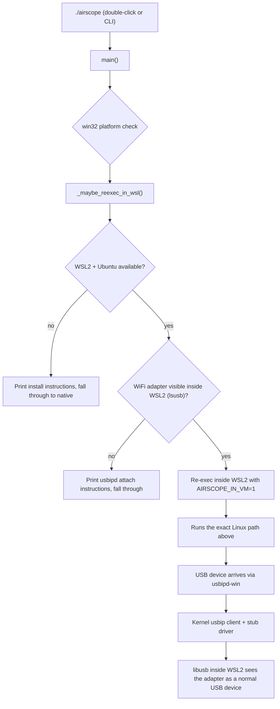
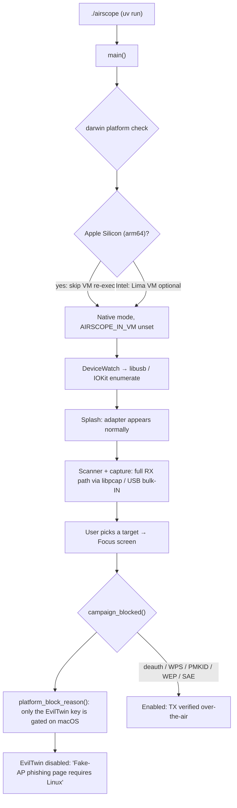
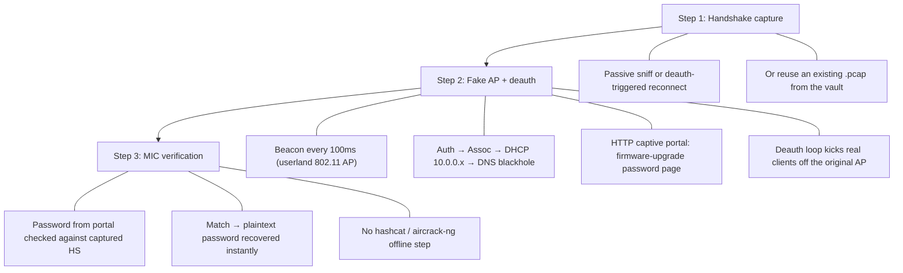

<p align="center">
  
</p>

<h1 align="center">airscope</h1>

<p align="center">
  <strong>Cross-platform Wi-Fi security auditor. Pure Python. Zero kernel drivers.</strong>
</p>

<p align="center">
  Scan networks. Capture handshakes. Test your defenses.<br>
  One beautiful terminal app that runs on Linux, Windows, and macOS.
</p>

<p align="center">
  <a href="https://github.com/udhaybhat00/airscope/blob/main/LICENSE"></a>
  
  
  <a href="https://github.com/udhaybhat00/airscope/actions/workflows/ci.yml"></a>
  
  
  
</p>

---

## Table of Contents

- [What is airscope?](#what-is-airscope)
- [Why airscope exists](#why-airscope-exists)
- [Quick Start](#quick-start-3-minutes)
- [How airscope works on each OS](#how-airscope-works-on-each-os)
- [Full architecture](#full-architecture)
- [Features](#features)
- [Supported Hardware](#supported-hardware)
- [First-time walkthrough](#first-time-walkthrough)
- [Usage examples](#usage-examples)
- [Comparison with other tools](#comparison-with-other-tools)
- [Skills & engineering highlights](#skills--engineering-highlights)
- [Development](#development)
- [Troubleshooting](#troubleshooting)
- [Roadmap](#roadmap)
- [License & Legal](#license--legal)

---

## What is airscope?

airscope is a **Wi-Fi security auditing tool** that runs on your laptop. It connects to a USB Wi-Fi adapter and helps you:

- **See** all nearby Wi-Fi networks in real time
- **Capture** the cryptographic "handshake" that proves a password was used
- **Test** whether your network is vulnerable to real-world attacks
- **Report** everything in formats your team can use

Think of it as **a stethoscope for your Wi-Fi network**: it listens, analyzes, and tells you what is wrong, in plain English.

### Who is this for?

| User | What you can do with airscope |
|------|-------------------------------|
| **Home user** | Check if your Wi-Fi password is strong enough |
| **IT admin** | Audit every network in the office, export a report |
| **Security researcher** | Full attack suite with real-time MIC verification |
| **Student** | Learn 802.11 wireless security hands-on |
| **Recruiter / reviewer** | See cross-platform systems engineering, protocol work, and security tooling in one codebase |

---

## Why airscope exists

### The problem with existing tools

Wi-Fi auditing in 2024+ still looks like this: install Kali Linux, run `airmon-ng`, fight driver versions, pray `modprobe` does not break your kernel, pipe five different tools together, and copy-paste output between terminals. That workflow is:

1. **Linux-only.** Nothing works on Windows or macOS.
2. **Kernel-dependent.** Monitor mode requires out-of-tree drivers that break on every kernel update.
3. **Glued together.** aircrack-ng + hostapd + dnsmasq + reaver + mdk3 are separate projects that barely talk to each other.
4. **Hostile to newcomers.** Errors like "ioctl SIOCSIWMODE failed: Operation not supported" teach nobody anything.

### The airscope answer

airscope reinvents the stack from the USB endpoint up:

- **No kernel drivers.** We talk to the USB device directly from userspace via PyUSB. The adapter never needs `airmon-ng`, `modprobe`, or a DKMS build on your machine.
- **No external tools.** The 802.11 frame stack, DHCP server, DNS blackhole, HTTP captive portal, handshake parser, and WPS machinery are all pure Python in this repository. There is no `hostapd` subprocess, no `dnsmasq` config, no shell-out to `reaver`.
- **One codebase, three OSes.** The same Python runs on Linux, Windows (via WSL2), and macOS. Platform differences are detected at runtime and communicated clearly to the user (for example, on macOS the EvilTwin button is disabled with the tooltip "Fake-AP phishing page requires Linux", while every other attack runs natively).
- **A real interface.** A 60fps Textual TUI plus an optional web dashboard, instead of a wall of terminal output.

### Concrete advantages

| | airscope | aircrack-ng stack | airgeddon |
|---|---|---|---|
| **Install** | `uv sync` | Kernel modules + 5 packages | Bash + many packages |
| **Kernel changes** | None | Monitor-mode drivers | Same as aircrack-ng |
| **OS support** | Linux + Windows + macOS | Linux only | Linux only |
| **External processes** | Zero | hostapd, dnsmasq, reaver, ... | All of them |
| **EvilTwin password check** | Real-time MIC verify, no offline crack | Manual export to hashcat | Manual |
| **WPA3 SAE handling** | Downgrade + MIC capture | Partial | No |
| **Interface** | TUI + web dashboard | CLI | CLI + xterm |
| **Test coverage** | 3,008 tests, hardware mocked | C unit tests | None |
| **Distribution** | Single PyInstaller binary | Package per distro | Script |

---

## Quick Start (3 minutes)

### Step 1: Get the code

```bash
git clone https://github.com/udhaybhat00/airscope.git
cd airscope
```

### Step 2: Install

**Linux** (Ubuntu, Debian, Kali):
```bash
sudo apt install python3 python3-venv libusb-1.0-0-dev iw
uv sync --group dev
uv run python -m airscope.doctor   # pre-flight check
```

**Windows** (10/11):
```powershell
# One-click setup (installs WSL2 + usbipd-win + airscope)
.\scripts\vm\setup.bat

# Or manually:
#   1. wsl --install
#   2. winget install dorssel.usbipd-win
#   3. Inside WSL2: git clone + uv sync (same as Linux)
```

**macOS** (Apple Silicon or Intel):
```bash
brew install uv libusb
uv sync --group dev
uv run airscope          # full attacks run natively (EvilTwin portal needs Linux)
```

### Step 3: Plug in your adapter and run

```bash
uv run airscope
```

The app walks you through everything else.

---

## How airscope works on each OS

This is the part most users and reviewers want to see first: **exactly what happens under the hood on each platform**, from `./airscope` to a frame leaving the antenna.

### The one-sentence version

| OS | Path | Scan | Capture | EvilTwin / Deauth |
|----|------|:----:|:-------:|:-----------------:|
| **Linux** | Native userspace, direct USB | Full | Full | Full |
| **Windows** | Auto-re-exec into WSL2, USB shared via usbipd-win | Full | Full | Full |
| **macOS** | Native userspace; TX verified over-the-air | Full | Full | Deauth/WEP full; EvilTwin portal Linux-only (labelled) |

### Linux: the native path



**Why it works natively:** Linux gives userspace direct access to `/dev/bus/usb/*` through libusb (after a one-time udev rule). The kernel's own Wi-Fi stack is completely bypassed, so no monitor-mode driver is ever loaded. The chip's firmware is brought into the right state by airscope's own register-level code.

**Key components on Linux:**
- `libusb` bulk transfers (read/write endpoints)
- udev rule for device permissions (installed on first run with `pkexec`)
- Optional DKMS driver *packages* in the repo document register maps; they are **not** required on the host

### Windows: transparent WSL2



**How USB gets into WSL2:** Windows owns the USB device. `usbipd-win` exports it over a virtual network to the WSL2 kernel, which re-creates it as a local device. From airscope's point of view inside WSL2, it is just a normal USB adapter. The user runs one command as Administrator:

```powershell
usbipd list                      # find your adapter's BUSID
usbipd bind --busid 2-3          # allow sharing (once)
usbipd attach --wsl --busid 2-3  # attach to WSL2
```

**Why WSL2 and not native Windows?** The 802.11 monitor/injection APIs are not exposed to Win32 userspace in any supported way. WSL2 gives us the full Linux USB and networking stack while the user stays on their Windows desktop. The re-exec is invisible: you run `airscope`, and the app knows to continue inside WSL2.

**Graceful degradation:** if WSL2 or the adapter is missing, airscope does **not** crash. Every WSL call is wrapped so the app prints actionable instructions and continues in native mode.

### macOS: full attacks, one exception



**What works natively on macOS:**
- USB device detection and control transfers (register reads/writes)
- Passive scanning and handshake capture (via `libpcap` and the system `airport` tool for channel control)
- **Frame transmission**: deauth, WPS/EAPOL, PMKID probes, WEP replay and SAE frames all go out over the air. Verified live on an RTL8822BU: an auth request reached a real AP and its auth response (status=0) came back
- Vault, reports, web dashboard, hashing/cracking

**The one exception: the EvilTwin fake-AP phishing page.** Its captive portal hands out DHCP/DNS through dnsmasq bound to a real OS-level interface, looked up in `/sys/class/net` (Linux-only). macOS never creates a system interface for these adapters (no Apple driver), so the portal has nothing to bind to. We surface that honestly instead of letting the button fail at runtime:

- The EvilTwin button is disabled with the tooltip **"Fake-AP phishing page requires Linux"**
- The splash screen, startup banner and doctor all state the same single exception
- The web dashboard applies the same gate (blocked label in the list, 422 on start)
- Every other attack (deauth, WPS, PMKID, WEP, SAE) is fully enabled

**Why not run the portal in a Linux VM on the Mac?** Apple's Virtualization framework refuses USB passthrough on Apple Silicon (until macOS 27), so even a Lima/QEMU VM cannot see the adapter there (Intel Macs with an existing Lima VM do get the VM path automatically). The practical answers are a Raspberry Pi or any Linux box.

### Side-by-side: the same code, three realities

```text
                     ┌──────────────────────────────┐
                     │   airscope Python codebase   │
                     │   (identical on all OSes)    │
                     └──────────────┬───────────────┘
                                    │
             ┌──────────────────────┼──────────────────────┐
             │                      │                      │
             ▼                      ▼                      ▼
      ┌─────────────┐       ┌──────────────┐       ┌──────────────┐
      │   LINUX     │       │   WINDOWS    │       │   macOS      │
      │ native      │       │ WSL2 re-exec │       │ native       │
      └──────┬──────┘       └──────┬───────┘       └──────┬───────┘
             │                     │                      │
             ▼                     ▼                      ▼
      ┌─────────────┐       ┌──────────────┐       ┌──────────────┐
      │ libusb      │       │ usbipd-win   │       │ libusb/IOKit │
      │ /dev/bus/usb│       │  →  WSL2     │       │ + libpcap    │
      └──────┬──────┘       │   libusb     │       └──────┬───────┘
             │              └──────┬───────┘              │
             │                     │                      │
             ▼                     ▼                      ▼
      ┌─────────────────────────────────────────────────────────┐
      │            USB WiFi adapter (e.g. RTL8812AU)           │
      │   RX: always works        TX: works on Linux/Win/macOS │
      │                           EvilTwin portal: Linux only  │
      └─────────────────────────────────────────────────────────┘
```

---

## Full architecture

### The stack

```text
┌─────────────────────────────────────────────────────────────────────┐
│ airscope (Python 3.11+, asyncio)                                   │
│                                                                     │
│  ┌──────────────┐  ┌───────────────┐  ┌─────────────────────────┐  │
│  │ Textual TUI  │  │ Web Dashboard │  │ Report / Vault          │  │
│  │ 60fps, CSS   │  │ optional      │  │ pcap/hc22000/CSV/HTML   │  │
│  └──────┬───────┘  └──────┬────────┘  └────────────┬────────────┘  │
│         │                 │                         │               │
│  ┌──────┴─────────────────┴─────────────────────────┴────────────┐  │
│  │ Attack Orchestrator (asyncio tasks, one radio mutex)         │  │
│  │ Scanner · EvilTwin · WPS PIN/PBC · WEP · PMKID · SAE · Batch│  │
│  └──────────────────────────┬────────────────────────────────────┘  │
│                             │                                       │
│  ┌──────────────────────────┴────────────────────────────────────┐  │
│  │ WlanInterface (802.11 abstraction: hopping, AP/client state) │  │
│  │ WlanFrameParser (pure-Python 802.11 frame parser)            │  │
│  └──────────────────────────┬────────────────────────────────────┘  │
│                             │                                       │
│  ┌──────────────────────────┴────────────────────────────────────┐  │
│  │ USB Worker Thread (PyUSB, blocking I/O off the event loop)   │  │
│  │ RX: bulk-IN  → descriptor decode → frame dispatch            │  │
│  │ TX: priority queue (mgmt > dhcp > http > beacon > deauth)    │  │
│  │ ACK tracking: RX tally + chip HW retry + software retry      │  │
│  └──────────────────────────┬────────────────────────────────────┘  │
│                             │                                       │
│  ┌──────────────────────────┴────────────────────────────────────┐  │
│  │ Userland 802.11 + network stack (pure Python)                │  │
│  │ Frame craft: beacon/auth/assoc/deauth/data/EAPOL             │  │
│  │ EvilTwin AP: DHCP server · DNS blackhole · TCP · HTTP portal │  │
│  │ Crack: handshake parser · PMKID · MIC verify · WPA-PSK       │  │
│  └──────────────────────────┬────────────────────────────────────┘  │
│                             │                                       │
│  ┌──────────────────────────┴────────────────────────────────────┐  │
│  │ chips/ — one driver package per chipset (20 supported)       │  │
│  │ transport (bulk + control) · firmware · MAC/PHY/RX/TX        │  │
│  │ Auto-discovered by VID:PID, lazy import                      │  │
│  └──────────────────────────┬────────────────────────────────────┘  │
│                             │                                       │
│              PyUSB / libusb → USB bulk endpoints                    │
└─────────────────────────────────────────────────────────────────────┘
```

### Key design decisions

| Decision | Why |
|----------|-----|
| **PyUSB over kernel drivers** | Cross-platform, no versioning hell, no `modprobe` blacklists |
| **asyncio + dedicated USB thread** | Non-blocking TUI with precise frame timing; USB I/O never stalls the render loop |
| **Textual over curses/raw rich** | Asyncio-native, CSS-like styling, real widget tree, keyboard bindings |
| **One radio mutex per campaign** | Two attacks can never fight over the same adapter; the UI disables conflicting buttons automatically |
| **Lazy chip imports** | The VID:PID registry is built by reading each chip's light `__init__` only; drivers load on first match, keeping startup fast |
| **Userland AP stack** | Full control over every 802.11 frame, no hostapd/dnsmasq config drift |
| **Platform gates in the model layer** | A single `campaign_blocked()` choke point decides what each OS can do, so the UI can never offer an attack that cannot run |

---

## Features

### Reconnaissance (passive)

- **Real-time scanner** — 2.4 + 5 GHz channel hopping, multi-card aggregation
- **AP & client identification** — vendor fingerprinting, WPS beacon parsing
- **VAP decloaking** — hidden SSID detection via BSSID correlation
- **Signal strength metering** — Excellent / Good / Fair / Weak tiers

### Captures

- **WPA/WPA2 4-way handshake** — passive sniffing + deauth-triggered
- **PMKID harvesting** — active + passive collection
- **WPS PushButton PSK capture**
- **Export formats** — `.pcap`, `.pcapng`, `.hc22000`, `.hccapx`

### Attacks

- **EvilTwin** — 3-step: handshake capture → fake AP + deauth → real-time MIC verification
  - Userland AP (auth, assoc, DHCP, DNS blackhole, TCP/HTTP captive portal)
  - Fake router firmware-upgrade page; works on iOS / Android / Windows / macOS clients
  - Password verified against the captured handshake instantly, no offline cracking
- **Deauthentication** — targeted and broadcast deauth bursts
- **WPS PixieDust** — offline PIN recovery
- **WPS PIN brute-force** — resumable
- **WEP suite** — ARP replay, ChopChop, fake auth, PTW key recovery
- **WPA3 SAE** — downgrade + MIC capture (passive, even works on macOS)
- **Batch "Auto Attack"** — sequential campaigns with progress and plain-English skip reasons

### Analysis & output

- **Vault** — capture manager, crack progress
- **Hashcat integration** — offline cracking of captured handshakes
- **Reports** — CSV, Kismet netXML, cracked.txt, HTML
- **Log translation** — 15+ technical events mapped to plain English

### UI / UX

- **Textual TUI** — asyncio-based, 60fps, keyboard-first
- **Web dashboard** — `--web` for a browser view with onboarding
- **Signal Noir theme** — dark + high-contrast, no hardcoded hex (design tokens)
- **Plain-English attack cards** and a 3-step EvilTwin progress indicator
- **Scanner freeze** (`F`) so rows stop re-sorting while you pick a target

---

## Supported Hardware

Any USB Wi-Fi adapter with a supported chipset should work. airscope auto-detects adapters by USB vendor/product ID — **20 chipsets across 25 driver packages** are in the tree.

### Recommended adapters

| Adapter | Chipset | Bands | Why it's good |
|---------|---------|-------|---------------|
| **Alfa AWUS036ACH** | RTL8812AU | 2.4 + 5 GHz | Best overall, reliable |
| **Alfa AWUS036ACM** | MT7612U | 2.4 + 5 GHz | Excellent Linux support |
| **TP-Link Archer T3U Plus** | RTL8822BU | 2.4 + 5 GHz | Budget-friendly |
| **Alfa AWUS036ACHM** | RTL8821AU | 2.4 + 5 GHz | Compact, reliable |

### Check your adapter

```bash
uv run python -m airscope.doctor --list-usb   # list USB devices
uv run python -m airscope.doctor --add-adapter 2357 0138   # add a custom one
```

Custom adapters persist in `~/.airscope/adapters.json` (one-time step). Full grading table: [docs/SUPPORTED-HARDWARE.md](docs/SUPPORTED-HARDWARE.md).

---

## First-time walkthrough

1. **Check your system** — `airscope.doctor` verifies Python, USB access, and adapter
2. **Splash screen** — pick your adapter (band badges `2G`/`5G` shown)
3. **Press START** — driver bring-up (first time only), then scanning
4. **Scanner** — live network table (signal, encryption, WPS, clients)
5. **Select a target** — Focus screen with attack cards
6. **Choose an attack** — e.g. EvilTwin (3-step guided flow)
7. **Review results** — Vault (captures, credentials, reports)

```text
 ┌──────────────────────────────────────────────────────┐
 │ Network          │ Ch │ Signal │ Enc │ Clients │ WPS │
 ├──────────────────┼────┼────────┼─────┼─────────┼─────┤
 │ HomeNetwork      │ 6  │ -42 dBm│ WPA2│ 3       │ No  │
 │ CoffeeShop_Guest │ 11 │ -65 dBm│ Open│ 12      │ Yes │
 │ Hidden_5G        │ 36 │ -58 dBm│ WPA3│ 1       │ No  │
 └──────────────────┴────┴────────┴─────┴─────────┴─────┘
```

### Keyboard shortcuts

| Key | Action |
|-----|--------|
| `Enter` | Select / confirm |
| `Space` | Mark target for batch |
| `F` | Freeze scanner |
| `Ctrl+P` | Preferences |
| `Esc` | Back / cancel |
| `q` | Quit |

---

## Usage examples

```bash
# Interactive TUI
uv run airscope

# Headless: scan 30s, then attack everything
uv run airscope --auto

# Specific targets
uv run airscope --auto --targets HomeNet,OfficeWiFi --scan-secs 60

# Just list what is in range
uv run airscope --auto --list

# Web dashboard (needs the web extra: uv sync --extra web)
uv run airscope --web
uv run airscope --web --demo        # no hardware needed

# Export reports
uv run airscope --export all --out my-report
```

### CLI flags

| Flag | Description |
|------|-------------|
| `--version` | Print version and exit |
| `--auto` | Headless batch mode |
| `--list` | Print APs in range and exit |
| `--targets` | Comma-separated BSSIDs or SSID substrings |
| `--scan-secs` | Seconds to scan before attacking (default 30) |
| `--web` / `--port` | Web dashboard (default 8765) |
| `--demo` | Simulated scan, no hardware |
| `--export` | `csv`, `netxml`, `cracked`, `html`, or `all` |
| `--debug` / `--trace` | Verbose logging |

---

## EvilTwin deep-dive



**Why real-time MIC verification matters:** traditional EvilTwin tools capture the handshake, export it, and make you run an offline cracker. airscope checks the submitted password against the captured EAPOL MIC immediately, so the attack is a single guided flow instead of three tools.

Captive-portal detection triggers the native popup on every OS: iOS/macOS (`/hotspot-detect.html`), Android (`/generate_204`), Windows (`/connecttest.htm`).

---

## Comparison with other tools

| Feature | airscope | aircrack-ng | airgeddon | Wifite |
|---------|----------|-------------|-----------|--------|
| **Platforms** | Linux + Windows + macOS | Linux only | Linux only | Linux only |
| **Kernel driver required** | No | Yes (monitor mode) | Yes | Yes |
| **External tools** | None | Many | Many | Many |
| **Interface** | TUI + Web | CLI | CLI + xterm | CLI |
| **EvilTwin** | Yes, 3-step with MIC verify | No | Yes (bash) | No |
| **WPA3 SAE** | Yes (downgrade + MIC) | Partial | No | No |
| **WPS PixieDust** | Yes | Yes (reaver) | No | Yes (reaver) |
| **Single binary** | Yes (PyInstaller) | No | No | No |
| **Tests** | 3,008 (hardware mocked) | C unit tests | None | None |
| **Language** | Python | C | Bash | Bash |

---

## Skills & engineering highlights

A summary of what this project demonstrates — useful for anyone reviewing the codebase.

### Systems & protocols

- **802.11 frame engineering** — crafting and parsing beacons, auth/assoc, deauth, EAPOL, probe, WSC/WPS IEs from raw bytes; sequence numbers, MMIE, RSNE/RSNX analysis
- **USB userspace programming** — PyUSB control transfers (register read/write), bulk endpoints, TX/RX descriptors, firmware upload, per-chipset bring-up sequences
- **ACK reliability model** — three-layer ACK architecture: RX tally, chip hardware retry, and software retransmit with timeout, per [docs/ACKS.md](docs/ACKS.md)
- **Reverse-engineered register maps** — ported MAC/PHY/RF/EFUSE init from kernel C drivers into pure Python for 20 chipsets
- **Userland network stack** — DHCP server, DNS blackhole, TCP state machine, and HTTP captive portal implemented from scratch for the EvilTwin AP

### Cross-platform engineering

- **Runtime platform detection** — one codebase with per-OS behavior: WSL2 auto-re-exec on Windows, Apple Silicon VM-re-exec skip on macOS, udev permissions on Linux
- **USB transport across OS boundaries** — usbipd-win integration for Windows, IOKit/libusb quirks handled on macOS, libpcap fallback for capture
- **Honest capability gating** — a single `campaign_blocked()` choke point disables any attack an OS cannot perform, with a human-readable reason in the tooltip
- **Graceful degradation** — every subprocess to WSL/lima wrapped so a missing VM prints instructions instead of crashing

### Architecture

- **Concurrency model** — asyncio event loop for the UI, a dedicated blocking USB worker thread, priority TX queue, and a global radio mutex so only one campaign owns the adapter
- **Plugin-style chipset discovery** — `pkgutil` walk over `chips/*` builds a VID:PID registry from lightweight `__init__` files; drivers lazy-import only on a match; DKMS family conflicts resolved by env var
- **Dataclass domain model** — `AccessPoint` / `Client` / `DeviceID` shared across scanner, campaigns, vault, and web
- **Design tokens for theming** — no hardcoded colors in CSS; palette lives in `tokens.py` and maps to Textual CSS variables

### Security tooling

- **Full attack surface** — EvilTwin, deauth, PMKID, WPS PIN/PBC, WEP (ARP replay, ChopChop, PTW), WPA3 SAE downgrade
- **Real-time MIC verification** — recovered plaintext checked against captured EAPOL without an offline cracker
- **Hashcat-compatible output** — `.hc22000` / `.hccapx` export for offline cracking workflows
- **Capture formats** — pcap/pcapng for Wireshark, Kismet netXML, CSV, HTML reports

### Quality engineering

- **3,008 tests, zero hardware** — all USB interactions mocked via `pytest-mock`; `asyncio_mode=auto`
- **Three CI workflows** — lint + tests on every push, PyInstaller release builds for 3 OSes with smoke tests, fingerprint data updates
- **Style guards as tests** — em-dash ban, comment policy enforced by `test_style.py`
- **PyInstaller distribution** — one executable per OS, version sourced from a single `__version__` literal

### Security-relevant practices

- **No secrets in code** — no keys, tokens, or credentials committed
- **Privilege separation** — Linux udev rule installed once with `pkexec`; runtime runs unprivileged
- **Legal framing** — GPL-2.0 license, explicit authorized-use notice, first-run acknowledgement in the web onboarding

---

## Development

```bash
uv sync --group dev        # install
uv run airscope            # run
uv run pytest              # test (3,008 tests, no hardware needed)
uv run ruff check src/     # lint (never format)
uv run textual run --dev src/airscope/ui/app.py   # hot-reload TUI
```

### Project structure

```text
airscope/
├── src/airscope/
│   ├── __main__.py          # entry point, CLI flags, per-OS re-exec
│   ├── doctor.py            # pre-flight checks
│   ├── tokens.py            # design tokens (Signal Noir palette)
│   ├── ui/                  # Textual screens (Splash → Scanner → Focus → Vault)
│   ├── device/              # DeviceManager, VID:PID registry, hot-plug watch
│   ├── wlan/                # WlanInterface, WlanFrameParser, AP/client registry
│   ├── dot11/               # 802.11 frame builders (beacon, auth, deauth, EAPOL, WSC)
│   ├── campaigns/           # EvilTwin, deauth, WPS, WEP, PMKID, SAE, batch
│   ├── evil_twin/           # captive portal, userland AP, USB worker
│   ├── crack/               # handshake parser, PMKID, MIC verify, WPA-PSK
│   ├── chips/               # 25 driver packages, 20 chipsets (transport/firmware/MAC/PHY/RX/TX)
│   ├── persist/             # capture storage, config, report export
│   └── web/                 # optional dashboard
├── tests/                   # 293 test files, 3,008 tests
├── docs/                    # HARDWARE, FIRMWARE, ACKS, THEMES, porting guides
├── scripts/                 # setup/launch scripts per OS
└── .github/workflows/       # ci.yml, release.yml
```

### Docs

- [docs/SUPPORTED-HARDWARE.md](docs/SUPPORTED-HARDWARE.md) — hardware compatibility & grading
- [docs/FIRMWARE.md](docs/FIRMWARE.md) — firmware loading
- [docs/ACKS.md](docs/ACKS.md) — ACK/retry architecture
- [docs/THEMES.md](docs/THEMES.md) — theme customization
- [CONTRIBUTING.md](CONTRIBUTING.md) — dev setup, PR guidelines
- [Landing page](https://udhaybhat00.github.io/airscope/) — feature overview and downloads (GitHub Pages)

---

## Configuration

| Setting | Where | Default |
|---------|-------|---------|
| Theme | `Ctrl+P` in the TUI | Signal Noir (dark) |
| Captures | `~/airscope/captures/` | Auto-created |
| Adapters | `~/.airscope/adapters.json` | Auto-populated |
| Password log | `~/airscope/logs/captured_passwords.log` | Auto-created |
| Web dashboard port | `--port` | 8765 |
| Log level | `--debug` / `--trace` | WARNING |

---

## Troubleshooting

| Problem | Cause | Fix |
|---------|-------|-----|
| "No adapter found" (Windows) | Wrong driver / not attached | `usbipd bind + attach --wsl --busid <ID>` |
| "No adapter found" (Linux) | No udev rule | Press START → allow the pkexec prompt |
| "No adapter found" (macOS) | IOKit authorization denied | System Settings → Privacy & Security → allow |
| Permission denied (Linux) | No udev rule | `echo 'SUBSYSTEM=="usb", MODE="0666"' \| sudo tee /etc/udev/rules.d/99-airscope.rules && sudo udevadm control --reload` |
| EvilTwin button disabled on macOS | Portal needs a Linux host interface | Expected: every other attack runs natively; use a Linux box for the phishing page |
| WSL2 cannot see the adapter | Not attached | `usbipd list` → `usbipd attach --wsl --busid <ID>` |
| Adapter visible but not detected | Uncommon VID:PID | `uv run python -m airscope.doctor --add-adapter <VID> <PID>` |
| PyInstaller binary crashes | Missing libusb | Install `libusb-1.0` (Linux) / WinUSB (Windows) |

More: [docs/LINUX-PERMISSIONS.md](docs/LINUX-PERMISSIONS.md).

---

## Roadmap

- [ ] `--connect user@linux-host` — control a remote Linux box from macOS
- [ ] Multi-AP EvilTwin (simultaneous rogue APs)
- [ ] WPA3-SAE full handshake capture (no downgrade)
- [ ] Plugin system for custom attacks
- [ ] BLE / Zigbee sniffing
- [ ] Cloud report sharing

---

## License & Legal

**Code:** [GNU General Public License v2.0](LICENSE)

**Firmware:** Vendor blobs are redistributed verbatim under their manufacturers' licenses (see [docs/FIRMWARE.md](docs/FIRMWARE.md)).

> **Legal Notice:** airscope is intended exclusively for use on networks and equipment you own or are explicitly authorized to audit. Unauthorized access to computer networks is illegal in most jurisdictions (e.g., CFAA in the US, IT Act 2000 in India, Computer Misuse Act in the UK). The author accepts no liability for misuse. Use at your own risk.

---

## Acknowledgments

- [PyUSB](https://github.com/pyusb/pyusb) — cross-platform USB access
- [Textual](https://github.com/Textualize/textual) — terminal UI framework
- [Python asyncio](https://docs.python.org/3/library/asyncio.html) — concurrent I/O
- [Realtek](https://www.realtek.com/) / MediaTek chipset reference drivers
- Attack workflows inspired by [Wifite](https://github.com/derv82/wifite2) and [aircrack-ng](https://www.aircrack-ng.org)

---

<p align="center">
  Built with care for the Wi-Fi security community.<br>
  Star this repo if it helped you! ⭐<br>
  <a href="https://github.com/udhaybhat00/airscope">github.com/udhaybhat00/airscope</a>
</p>
